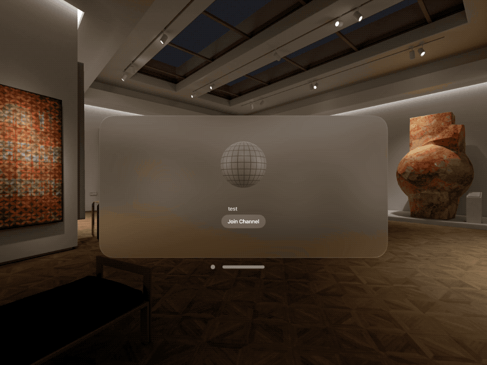

# Vision Pro Agora Sample App

## Overview

This sample app demonstrates how to integrate the Agora SDK with the Vision Pro framework for a video conferencing application. The app allows users to join a video call by entering a channel name.

    

## Prerequisites

Before running the app, ensure you have the following:

- Xcode 15.0 or later.
    - Must be a Beta version of Xcode to use visionOS.
- Agora account and App ID (replace <#appID#> in the code with your Agora App ID)

## How to Use

1. Clone the repository to your local machine.
1. Open the project in Xcode.
1. Open the ContentView.swift file and replace <#appID#> with your test mode Agora App ID.
1. Build and run the app on an visionOS simulator, or device.
1. Enter a channel name in the provided text field and tap "Join Channel."

---

Feel free to customize and expand upon this sample app to meet your specific requirements. For detailed information on the Agora SDK and Vision Pro framework, refer to the official documentation provided by Agora and Apple.
