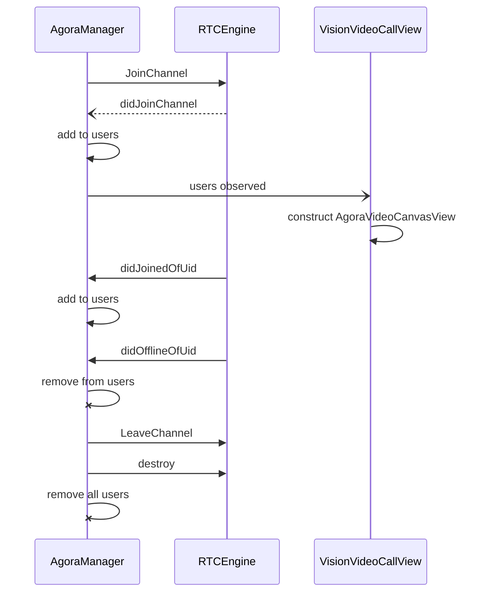

# VisionPro Meets the World: Video Chat with Agora's Video SDK

 

The future is here, and you're holding it – the Apple VisionPro device. It's a marvel of technology, but sometimes, you just need to see a friendly face across the digital divide. That's where Agora's ubiquitous Real-Time Communication (RTC) SDK comes in. With Agora, video chat on your VisionPro device transcends physical boundaries. You can connect with other VisionPro users, and Agora's expansive reach allows you to chat seamlessly with people on entirely different platforms. Imagine video calling your friends and family on their smartphones, tablets, or laptops – all through the power of Agora on your VisionPro. This quick start guide will equip you to unlock the potential of Agora's native RTC SDK and transform your VisionPro into a powerful video chat hub. 

> If you are a Unity developer, you may refer to [this blog](https://www.agora.io/en/blog/vision-pro-unity-quickstart-with-agora-sdk/) for the corresponding quick start guide.


## Prerequisites:

-   Apple VisionPro    
-   Apple computer with Silicon CPU Chip (M1 or newer generation)
-   Xcode (15.4)  with VisionOS Support
-   Agora Developer account
    
## Setups

1.  Clone the GitHub project from [this location](https://github.com/AgoraIO-Community/visionOS-Quickstart).
2. Open the project with Xcode.
3. Import the Agora SDK plugin. The project includes the Agora SDK as a dependency package. As soon as Xcode loads the project, the package download should start automatically and finish in a few minutes.

If the package did not load for some reason, e.g. networking issues, or you are setting up a brand new project of your own, see the following information to cover the package manager, CDN, and cocoapods.

1. To manually add the package to your Xcode project, put the specific branch of the git location as the dependency:

2.  CDN download     [https://download.agora.io/null/Agora_Native_SDK_for_iOS_rel.v4.2.6.133_39484_FULL_20240126_0204_291749.zip](https://download.agora.io/null/Agora_Native_SDK_for_iOS_rel.v4.2.6.133_39484_FULL_20240126_0204_291749.zip)
    
3.  Cocoa Pods
```Makefile  
	pod 'AgoraRtcEngine_Special_iOS', '4.2.6.133.VISION'
```
## Running the App

Fill in your test mode Agora app ID in the appID field in VisionVideoCallView.swift.


Build and run for either the Simulator or your physical VisionPro device. At the same time, prepare a second user to join the chat as a remote user.

### Remote User Setup

Use another device or use the Agora Web demo app for connecting to the video chat channel. The following screenshot shows a web user published video feed using the same App ID and channel name.


  

### Running on Simulator

Since there is no camera simulation in the simulator, your local video stream won’t be presented to the other users. However, you can still see other users who have enabled their cameras or custom video feeds on their devices. The following screenshot captures what you will see in the simulator.


### Running on VisionPro Device

Before building your project to the device, Add the following keys to your Info.plist file to request the necessary permissions:
```xml
<key>NSCameraUsageDescription</key>
<string>camera for self capture</string>
<key>NSMicrophoneUsageDescription</key>
<string>mic for my voice</string>
```
  


You should confirm your permission to allow the app to use your VisionPro’s camera and microphone. Once you join the channel, you should see yourself in your avatar form and the remote user should show up on your screen!


The Web user can also see you in your digital form and you can start chatting together now!


  

## Basic Code Walkthrough

Reading and understanding the code is never a boring task for developers! Here is a break-down of the project source so you can find the area of your interest quickly.

|Class|Purpose|Notes|
| --------   | -----:  | :----:  |
Agora_VisionApp|Entry point of application|Standard entry point
ContentView|UI View presenting to user at the beginning|Accepts the meeting’s channel name. Calls VisionVideoCallView
VisionVideoCallView|Showing user’s video feeds as a grid format|Input the appID here
AgoraVideoCanvasView|The video canvas view for rendering the video|This is a reusable class that works on iOS/MacOS as well.
AgoraManager|The controller of the app business logic that implements Agora RTC Engine’s delegates.|Respond to join channel and leave channel; handles callback events like _didJoinedOfUid_ and _didJoinChannel_.

You should see the code follows the logic flow described in the [official documentation](https://docs.agora.io/en/video-calling/get-started/get-started-sdk?platform=ios).  

### Essential API Calls
* Create an Agora RTC engine
```swift
        let config: AgoraRtcEngineConfig = AgoraRtcEngineConfig()
        config.appId = appId
        config.audioScenario = .gameStreaming
        config.channelProfile = .liveBroadcasting      
        let eng = AgoraRtcEngineKit.sharedEngine(with:config , delegate: self)
```
* Join a channel
```swift
        self.agoraEngine.joinChannel(byToken: token, channelId: channel, info: info, uid: uid)
```
* Leave a channel
```swift
		self.agoraEngine.leaveChannel(leaveChannelBlock)
```
* Dispose of the engine
```swift
		AgoraRtcEngineKit.destroy()
```

### View Update Sequence




## Conclusion

As you've seen, integrating Agora's RTC SDK into your VisionPro app for video chat is surprisingly straightforward. The provided quick start project on GitHub serves as a fantastic springboard, offering a basic structure you can build upon. With just a few steps and a little code modification, you've unlocked the power of real-time communication for your VisionPro device.

The true beauty lies in Agora's cross-platform capabilities. Forget limitations! You can now video chat with friends and family on any device, regardless of their operating system. This opens doors for unparalleled collaboration and connection, shattering the boundaries between platforms.

So, dive into the world of Agora's RTC SDK and unleash the full potential of video chat on your VisionPro. With its ease of use and expansive reach, Agora empowers you to connect with the world on a whole new level.
