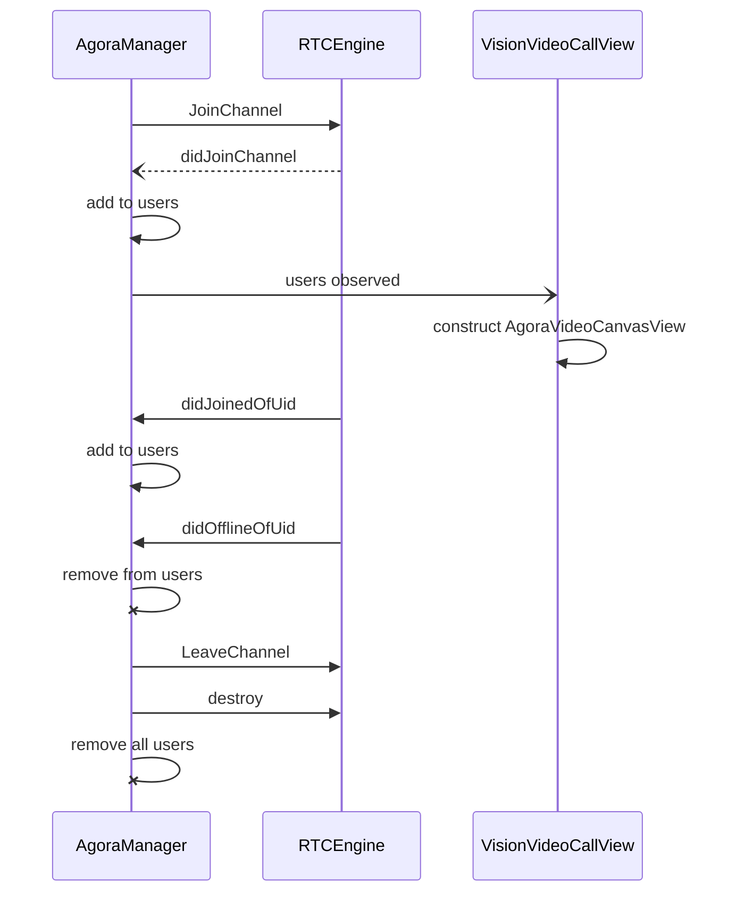

# VisionPro Meets the World: Video Chat with Agora's Video SDK

 

The future is here, and you're holding it – the Apple VisionPro device. It's a marvel of technology, but sometimes, you just need to see a friendly face across the digital divide. That's where Agora's ubiquitous Real-Time Communication (RTC) SDK comes in. With Agora, video chat on your VisionPro device transcends physical boundaries. You can connect with other VisionPro users, and Agora's expansive reach allows you to chat seamlessly with people on entirely different platforms. Imagine video calling your friends and family on their smartphones, tablets, or laptops – all through the power of Agora on your VisionPro. 

This quick start guide will equip you to unlock the potential of Agora's native RTC SDK and transform your VisionPro into a powerful video chat hub.  We will show you the way on how to set up and run the Quickstart project using both the simulator and the actual device.  And we will walk through the code with an architecture overview and provide remarks on important APIs.

> If you are a Unity developer, you may refer to [this blog](https://www.agora.io/en/blog/vision-pro-unity-quickstart-with-agora-sdk/) for the corresponding quick start guide.


## Prerequisites:

-   Apple VisionPro    
-   Apple computer with Silicon CPU Chip (M1 or newer generation)
-   Xcode (15.4)  with VisionOS Support
-   Agora Developer account
    
## Setups

1.  Clone the GitHub project from [this GitHub repo](https://github.com/AgoraIO-Community/visionOS-Quickstart).
2. Open the project with Xcode:  import the Agora SDK plugin. The project includes the Agora Video SDK as a dependency package. As soon as Xcode loads the project, the package download should start automatically and finish in a few minutes.

If the package did not load for some reason, e.g. networking issues, or you are setting up a brand new project of your own, see the following information to cover the package manager, CDN, and cocoapods.

1. To manually add the package to your Xcode project, put the specific branch of the git location as the dependency:

2.  Zip file [CDN download](https://download.agora.io/null/Agora_Native_SDK_for_iOS_rel.v4.2.6.133_39484_FULL_20240126_0204_291749.zip)
    
3.  Cocoa Pods
```Makefile  
	pod 'AgoraRtcEngine_Special_iOS', '4.2.6.133.VISION'
```
## Running the App

Open VisionVideoCallView.swift. and fill in your Agora app ID in the appID field.  

> This guide is made for Agora projects without security enabled.  You should use a Test Mode app ID for the testing of this project. It is important to understand that authentication security is crucial and must be implemented for your actual application.  Please refer to [this guide](https://docs.agora.io/en/video-calling/core-functionality/integrate-token-generation?platform=ios) for token security implementation.


Build and run for either the Simulator or your physical VisionPro device. At the same time, prepare a second user to join the chat as a remote user.

### Remote User Setup

Since we are making an app that enables user video chat, we will have the VisionPro user as the local user and we will need another user as the remote user.  Both users should appear in the application.

You have two options for the remote users application.  

 1. Use another physical device, including but not limited to another VisionPro device.  If you not the first time Agora developer, and have already built another Agora app with the sample app ID on any platform, you are good to go.  
 2. Use the [Agora Web demo app](https://webdemo-global.agora.io/example/basic/basicVideoCall/index.html).  This is the quickest way to test any new applications.

In this tutorial, we will use the web demo to run as our remote user.   The following screenshot shows a web user published video feed using the same App ID and channel name.


### Execution Sequence
1. You can start either the VisionPro user or the web user first.  
2. Upon launch, the VisionPro user should see a dialog waiting for input.  Enter the channel name (e.g. "visionpro") and hit the Join button. 

4. The flow should be similar on other platforms.  In our case, the web user will need to enter the channel name, press the button in Step 1 to 3 as shown in above screenshot.
5. The remote user should show up on the VisionPro demo's display panel automatically.
6. For the web demo, the remote user id should populate itself when the VisionPro user joins successfully.  Press "Subscribe and Play" button to show the video stream from VisionPro.
7. When the chat session is finished on VisionPro, press the "<" button to leave the channel. 


More environment specific description follows.

### Running on Simulator

Since there is no camera simulation in the VisionPro simulator, your local video stream won’t be presented to the other users. However, you can still see other users who have enabled their cameras or custom video feeds on their devices. The following screenshot captures what you will see in the simulator.


### Running on VisionPro Device

Before building your project to the VisionPro device, Add the following keys to your Info.plist file to request the necessary permissions:
```xml
<key>NSCameraUsageDescription</key>
<string>camera for self capture</string>
<key>NSMicrophoneUsageDescription</key>
<string>mic for my voice</string>
```

The permission request dialog should show up when you press the Join button.  You should confirm your permission to allow the app to use your VisionPro’s camera and microphone. Once you joins the channel, you should see yourself in your avatar form and the remote user should show up on your screen!


On the other device/web browsers, the user can also see you in your digital form and you can start chatting together now!


  

## Basic Code Walkthrough

If you are wondering how the components work together in this project, please read on. The following section aims to provide a clear and concise explanation of the code structure, logic, and flow.  

### Code Structure
|Class|Purpose|Notes|
| --------   | -----:  | :----:  |
Agora_VisionApp|Entry point of application|Standard entry point
ContentView|UI View presenting to user at the beginning|Accepts the meeting’s channel name. Calls VisionVideoCallView
VisionVideoCallView|Showing user’s video feeds as a grid format|Input the appID here
AgoraVideoCanvasView|The video canvas view for rendering the video|This is a reusable class that works on iOS/MacOS as well.
AgoraManager|The controller of the app business logic that implements Agora RTC Engine’s delegates.|Respond to join channel and leave channel; handles callback events like _didJoinedOfUid_ and _didJoinChannel_.

### Logic Flow
This quickstart demo follows a typical SwiftUI logic hierarchy.  The Agora_VisionApp class defines the entry point, which brings a the ContentView.  The ContentView is a container that uses a NavigationStack to allow Join channel user interface and the VisionVideoCallView interface to swap places, according to the current session state. 

When the user hits the Join button, the VisionVideoCallView is constructed and pushed into the view stack.  And video call session starts after the AgoraManager's initialization.  

AgoraManager is an [observed object](https://developer.apple.com/documentation/swiftui/observedobject)  that will implicitly causes updates to the view.  The *localUserId* property and the *allUsers* property from AgoraManager are being observed.  

When the VisionPro user joins the channel, the *didJoinChannel* event callback populates the *localUserId*.  When a remote user joins the channel, the *didJoinedOfUid* callback adds that user's uid to the allUsers collection.  On the other hand, when a remote user leaves the channel, the *didOfflineOfUid* callback remove the user from the *allUsers* collection.  Whenever the *allUsers* value changes, VisionVideoCallView updates its canvas view grid automatically.  

Class AgoraVideoCanvasView encapsulates the logic for populating a canvas with video stream using an uid as the input.  The code is well documented and aims to be reusable for the iOS/MacOS and visionOS projects.

When the user hits the back button, NavigationStack pops the view stack and thus the VisionVideoCallView gets destroyed.  At such point, AgoraManager invokes LeaveChannel(), which will cleanup the canvas views and dispose the Agora engine.


### View Update Sequence



### Essential API Calls
* Create an Agora RTC engine
```swift
        let config: AgoraRtcEngineConfig = AgoraRtcEngineConfig()
        config.appId = appId
        config.audioScenario = .gameStreaming
        config.channelProfile = .liveBroadcasting      
        let eng = AgoraRtcEngineKit.sharedEngine(with:config , delegate: self)
```
* Join a channel
```swift
        self.agoraEngine.joinChannel(byToken: token, channelId: channel, info: info, uid: uid)
```
* Leave a channel
```swift
		self.agoraEngine.leaveChannel(leaveChannelBlock)
```
* Dispose of the engine
```swift
		AgoraRtcEngineKit.destroy()
```


### Local Camera Stream
If you are an experienced Agora developer, you may see all the APIs are the same as you've done in implementing an iOS app.   You may wonder - how do I create a stream to capture my Avatar from the VisionPro? The answer is you don't need to.  The beauty of the visionOS is that - your avatar rendering frames are used for your local camera's view.  Therefore, without any change to the API calls, you get the same behavior to stream your local camera view!   


## Conclusion

As you've seen, integrating Agora's RTC SDK into your VisionPro app for video chat is surprisingly straightforward. The provided quick start project on GitHub serves as a fantastic springboard, offering a basic structure you can build upon. With just a few steps and a little code modification, you've unlocked the power of real-time communication for your VisionPro device.

The true beauty lies in Agora's cross-platform capabilities. Forget limitations! You can now video chat with friends and family on any device, regardless of their operating system. This opens doors for unparalleled collaboration and connection, shattering the boundaries between platforms.

So, dive into the world of Agora's RTC SDK and unleash the full potential of video chat on your VisionPro. With its ease of use and expansive reach, Agora empowers you to connect with the world on a whole new level.  

For further reading, it is worthwhile to check out the following resources:
* [iOS quickstart guide](https://docs.agora.io/en/video-calling/get-started/get-started-sdk?platform=ios) 
* [API references](https://api-ref.agora.io/en/voice-sdk/ios/4.x/documentation/agorartckit).  

